# 영화 추천 사이트 MOVIEEKER

> SSAFY 1학기 종합 프로젝트로 진행한 영화 추천 사이트 MOVIEEKER에 대한 소개 및 
>
> 개발 과정, 작업 중 느낀점을 담아 보았습니다😊

## 1. 프로젝트 및 서비스 설명

### 	- 기획 의도

​	넘쳐나는 영화, 늘어나는 스트리밍 사이트 그 속에서 어떤 영화를 봐야할 지 망설이는 사람들이 많다.

​	넷플릭스 추천 영화나 왓챠 인기 영화를 검색하는 사람들이 많다는 것은 이러한 사실을 증명해주는 것이 아닐까.

​	우리는 이를 해소하기 위해 영화의 평점과 인기도를 기반으로 영화를 추천해주는 사이트 MOVIEEKER 프로젝트를 기획하게 되었다.

### 	-  프로젝트 소개

​	영화 추천 사이트 MOVIEEKER는 MOVIE(영화)와 SEEKER(~을 구하는 사람)의 합성어로서 영화를 보고 싶은 사람을 위한 서비스를 의미한다.

​	영화는 보고 싶은데 무엇을 봐야할 지 모를 때, 간단한 회원가입을 통해 영화리스트를 확인 및 평점 기록이 가능하며, 본인에게 맞는 영화를 추천받을 수 있다.

### 	-  주요 기능

- 관리자 뷰
- 영화 리스트 확인
- 영화 평점 기록 / 수정 / 삭제
- 평점 및 인기도 기반 영화 추천 받기
- 랜덤 영화 추천 받기
- 영화 관련 게시글 작성 / 수정 / 삭제
- 게시글 댓글 작성 / 삭제

### - 개발환경

- Python

  - Python 3.7.7

  - Django 3.1.3

- Vue.js

  - vue/cli 4.5.8

- Database

  - sqlite3

## 2. 작업 기간

2020.11.18(수) ~ 2020.11.26(목) 총 9일

## 3. 팀 이름

TEAM MOVIEEKER

## 4. 팀원 정보 및  담당 업무

✨ 김순석, 김윤빈 ✨

김순석 

-  Django API Server 설계 및 Data Seeding 구현
-  Django, Vue.js를 활용한 영화 추천 / 평점 / 댓글 기능 구현

김윤빈

- HTML, CSS, BootstrapVue를 활용한 UI 구현 및 디자인
- Django, Vue.js를 활용한 커뮤니티 기능 구현

## 5. 목표 서비스 구현 및 실제 구현 정도

### - 목표 서비스

- 유저 평점 기록
- 평점을 기반으로 한 영화 추천 서비스
- 영화 관련 글을 남길 수 있는 게시판

### - 실제 구현

- 유저 평점 기록 서비스 구현
- 영화 자체 평점 및 인기도 기반의 추천 서비스 구현
- 영화 관련 글을 남길 수 있는 게시판 기능 구현

### - 구현 화면

- 로그인/회원가입 (로그인과 회원가입 + 로그아웃 기능)

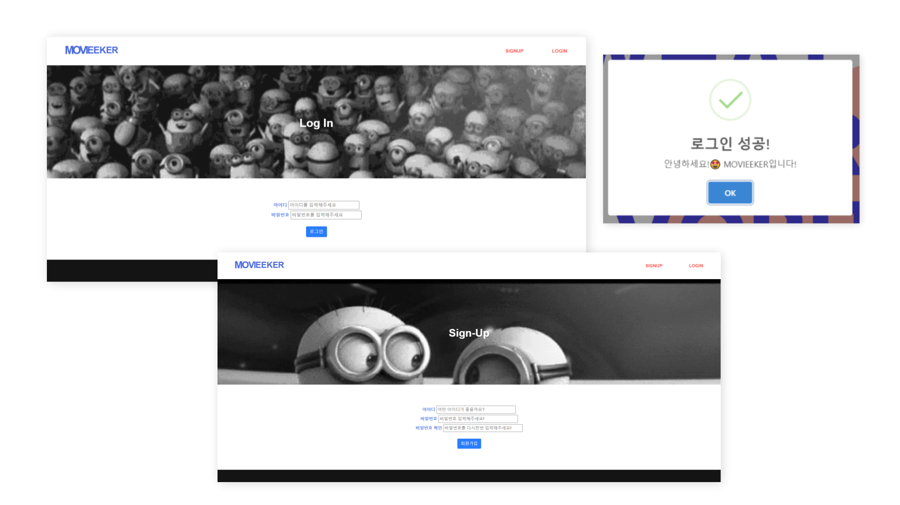

- 메인페이지 (타이틀/영화리스트/명언/이미지)

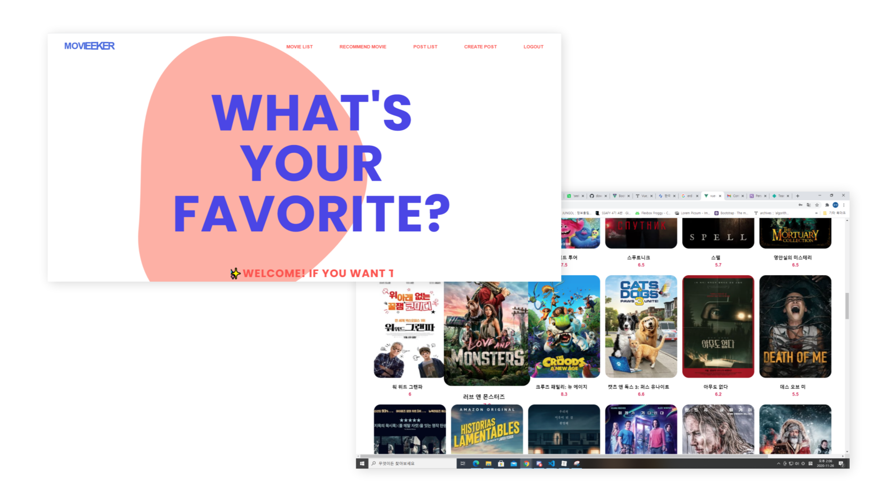

- 영화리스트 (주제별 영화리스트/상세페이지)

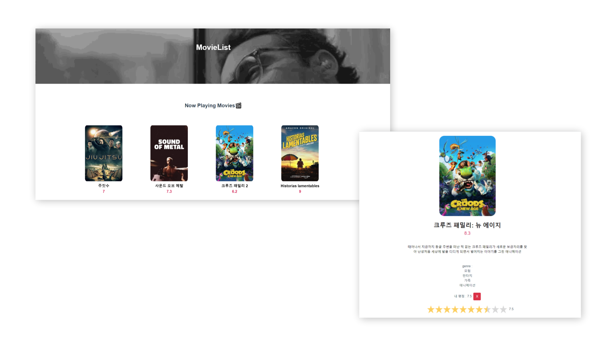

- 추천페이지 (랜덤추천 / 영화평점 및 인기도 기반 추천)

  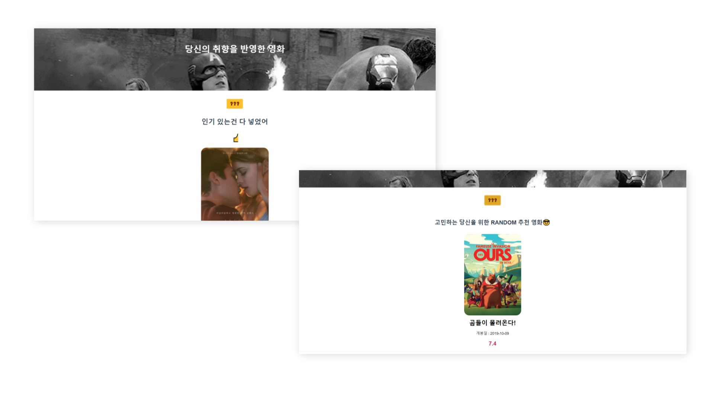

- 커뮤니티 (게시판 및 게시글 상세 페이지)

  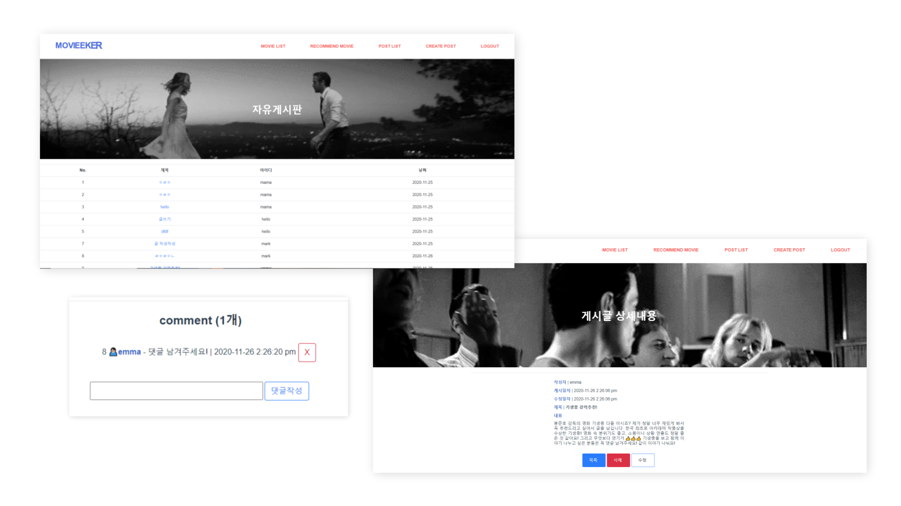

- 게시글 생성 & 수정 페이지 (게시글 생성/수정/삭제 + 댓글 기능)

  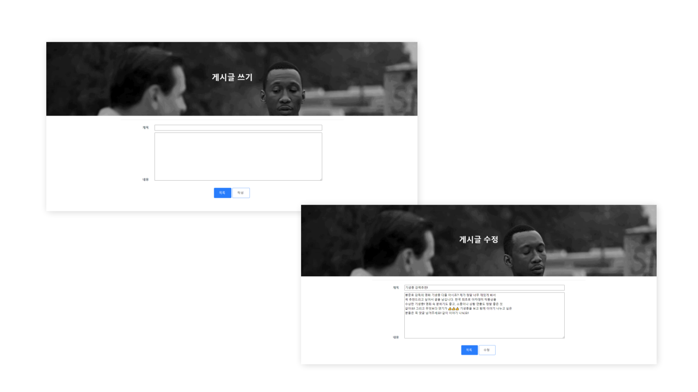

- 반응형 페이지

- 기타 (navigation bar, page footer, 명언 및 이미지)

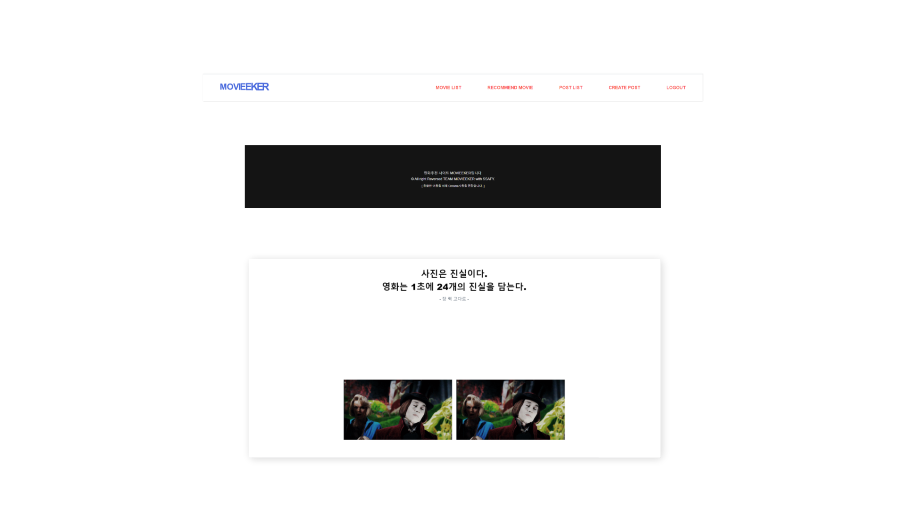

## 6. 데이터베이스 모델링(ERD)

### 1. Back-end(Django)

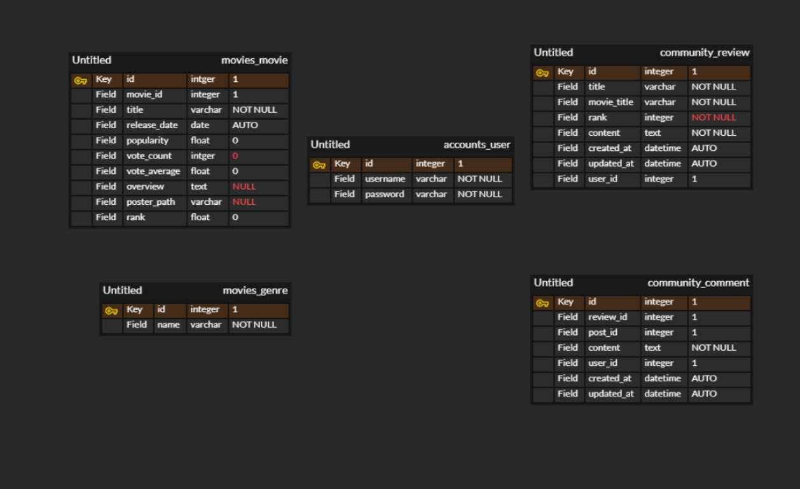

### 2. Front-end(Vue.js)

#### 1. main

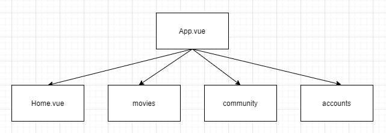

#### 2. home

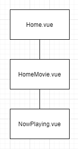

#### 3. movie

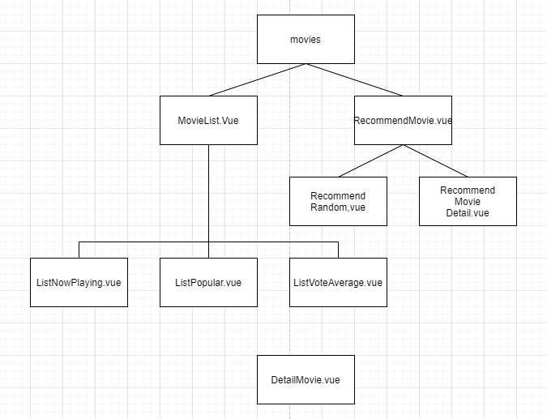

#### 4. community

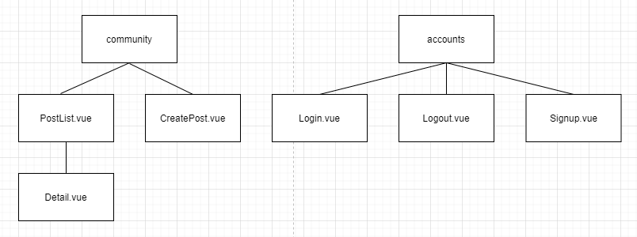

## 7. 필수 기능 설명

### 1. 영화 추천 기능

​	메인 화면에 TMDB API를 활용하여 현재 상영 중인 영화들의 목록과 기본 정보들을 출력하여 사용자에게 보여주고, 클릭 시 해당 영화의 상세 페이지로 화면이 전환되는 기능을 구현하였다. 

​	Movie LIst에는 상영 중, 높은 평점, 높은 인기도 별로 영화 목록을 출력하였고, 각각의 영화를 클릭하면 해당 영화의 상세 페이지로 넘어간다.

​	Recommend Movie에서는 평점이 높은 영화 중에서 인기도가 높은 영화 50여 개를 후보로 랜덤하게 한 개의 영화를 추천해주는 탭과 상위 5개의 영화를 사용자에게 보여준다. 각 영화를 클릭하면 상세 페이지로 이동한다.

​	상세 페이지에서는 영화의 줄거리 등을 포함한 상세 정보가 담겨 있고, 본인이 평점을 주고 수정, 삭제가 가능한 평점기능을 구현하였다.

### 2. 커뮤니티(게시판) 기능

​	영화와 관련된 주제로 자유롭게 이야기를 나눌 수 있는 자유게시판은 <b>게시글 생성 및 조회, 그리고 수정, 삭제가 모두 가능</b>하다. 

​	게시글을 한 번에 모아서 확인할 수 있는 리스트 페이지를 구현하였으며, 이때 글 번호 및 글 제목, 작성자, 그리고 글이 생성된 시각(수정했다면 수정한 시각)을 확인할 수 있다. 

​	게시판을 확인하고 상세 글을 보는 것은 로그인한 사용자라면 모두 가능하나, 작성된 글의 수정 및 삭제는 해당글을 직접 작성한 유저만이 가능하다. 

​	또한 사용자들은 해당 게시글의 상세 페이지로 가서 게시글과 관련하여 댓글을 작성할 수 있으며, 해당 댓글을 작성한 사용자에 한하여 댓글을 삭제할 수도 있다.

## 8. 프로젝트를 진행하며 느낀점

### - 김윤빈

​	작업 초반에 django로만 개발을 진행하다 한계를 느껴 django와 vue.js를 함께 사용하여 개발을 진행하게 되었다. 시간이 부족하지는 않을까? 혹은 vue.js를 잘 사용할 수 있을까? 하는 걱정도 있었지만, 시행착오를 겪으며 결국 두려움을 극복할 수 있었다고 생각한다.

​	글 생성 및 게시판 리스트 기능을 완성하고 나서, 삭제 기능을 구현할 때 데이터가 제대로 처리되고 있는 것인지 바로 파악하지 못해서 시간을 많이 소요했다. django의 view.py부분에 print를 찍고, vue에서는 console.log()를 통해 데이터가 잘 전달되고 있는지 하나하나 체크하였다. 이를 통해 이전보다 수월하게 삭제 기능을 구현할 수 있었으며 이어서 수정 기능 또한 빠르게 구현 가능했다. 

​	한편, 프로젝트 전반의 UI배치 및 디자인을 담당하며 처음에는 각 컴포넌트를 원하는 형식대로 위치 및 변형하는 것이 어려웠다. 또한 부모 자식 요소가 어떠한 관계를 이루고 있는지 파악하는 것이 복잡하게 느껴지기도 했다. 그러나 vue에 적힌 코드를 천천히 따라가며 작업하다 보니 작업이 진행될수록 수월하게 관계를 파악할 수 있게 되었고, 이전보다 배치에도 익숙해지게 되었다. 

​	MOVIEEKER라는 프로젝트만의 개성을 살려 동적인 느낌의 디자인을 하고 싶었으나, CSS기능 활용에 충분히 익숙하지 않은 터라 한계가 느껴지기도 했다. 대신 색감과 gif이미지를 적극적으로 활용하여 나름대로 기존 영화 사이트와는 조금 다른 결의 영화 추천 서비스를 완성할 수 있었다고 생각한다. 

​	프로젝트를 진행하며 많이 배웠고, 앞으로 학습할 부분 또한 많다는 것을 깨달았다. 원격으로 협업하는 것의 장점과 시간을 투자하여 오류를 해결했을 때의 기쁨을 느낄 수 있는 시간이었다.

